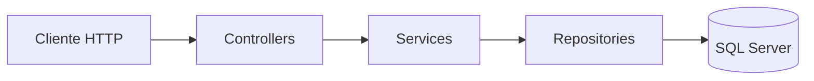

# Arquitetura da API — PitLaneShop

Documentação da API ASP.NET Core do repositório, com foco em **camadas lógicas**, **fluxo de pedidos** e **infraestrutura**.

## Visão geral

| Aspeto | Escolha |
|--------|---------|
| Framework | ASP.NET Core 8 (Web API) |
| ORM | Entity Framework Core 8 + provedor **SQL Server** |
| Documentação HTTP | Swagger / OpenAPI (Swashbuckle), ativo em **Development** |
| Hospedagem local | Kestrel; opcionalmente **Docker** (`backend/PitLaneShop/docker-compose.yml`) |

O projeto é um **único assembly** (`PitLaneShop.csproj`), com pastas que separam responsabilidades (não há múltiplos projetos de biblioteca).

## Estrutura de pastas (camadas lógicas)

```
backend/PitLaneShop/PitLaneShop/
├── Controllers/          # Entrada HTTP (REST)
├── Model/
│   ├── Entities/         # Entidades de domínio + EntidadeBase
│   ├── Enums/
│   └── Repositories/     # Apenas interfaces de repositório
├── Persistence/
│   ├── PitLaneShopDbContext.cs
│   ├── EntitiesMapping/  # IEntityTypeConfiguration<T> (Fluent API)
│   ├── Migrations/
│   └── Repositories/     # Implementações EF dos repositórios
├── Services/
│   ├── Abstractions/     # IBaseCrudService + BaseCrudService<TEntity, …>
│   └── Features/
│       └── Cliente/      # Dtos, IClienteService, ClienteService
└── Program.cs            # Composição (DI), pipeline, migrações ao arranque
```

## Fluxo de um pedido (cliente HTTP)



1. **Controllers** — recebem o pedido REST, validam o modelo (`[ApiController]`), chamam o **serviço** e devolvem códigos HTTP adequados (200, 201, 204, 404, etc.).
2. **Services** — orquestram o caso de uso, trabalham com **DTOs** e mapeiam para/da entidade.
3. **Repositories** — encapsulam acesso a dados via **EF Core** (`DbSet<T>`, `SaveChanges`).
4. **DbContext** — mapeia entidades para tabelas (incluindo configurações em `EntitiesMapping`).

As **interfaces** de repositório ficam em `Model/Repositories`; as **implementações** em `Persistence/Repositories`, o que reduz acoplamento da “camada de modelo” à EF nas interfaces.

## Modelo e persistência

- **EntidadeBase** — `Id` (`Guid`), `DataCriacao`, `DataAtualizacao` (auditoria básica).
- Entidades de negócio: `Cliente`, `Carro`, `VeiculoModelo`, `TarifaDiaria`, `Aluguel` (ver também [diagram.md](diagram.md)).
- **Migrações** — pasta `Persistence/Migrations` (ex.: `PitLaneShopV1`). Ao arranque, `Program.cs` chama `Database.Migrate()` para criar/atualizar a base.

## Serviços e CRUD genérico

- **`IBaseCrudService<TResponseDto, TCreateDto, TUpdateDto>`** — contrato CRUD só em DTOs.
- **`BaseCrudService<TEntity, TResponseDto, TCreateDto, TUpdateDto>`** — implementação genérica sobre `IBaseRepository<TEntity>`, com métodos abstratos de mapeamento (`MapToResponse`, `MapFromCreate`, `ApplyUpdate`).
- **Cliente** — `IClienteService` estende o contrato base; `ClienteService` herda de `BaseCrudService` e implementa os mapeamentos.

Outras entidades podem seguir o mesmo padrão (novo feature em `Services/Features/...`, repositório já existente).

## API REST exposta

Hoje o recurso documentado de ponta a ponta (controller + serviço) é **clientes**:

| Método | Rota | Descrição |
|--------|------|-----------|
| GET | `/api/clientes` | Lista |
| GET | `/api/clientes/{id}` | Detalhe |
| POST | `/api/clientes` | Criação (201 + `Location`) |
| PUT | `/api/clientes/{id}` | Substituição completa |
| DELETE | `/api/clientes/{id}` | Remoção (204) |

Respostas em **JSON** (`application/json`).

## Composição e configuração (`Program.cs`)

- Lê **`ConnectionStrings:DefaultConnection`** (ex.: LocalDB no `appsettings.json`).
- Regista **`PitLaneShopDbContext`** com **SQL Server**.
- Regista repositórios e serviços com **escopo** `Scoped` (alinhado ao ciclo de vida do pedido HTTP).
- **`EnsureDatabaseAndApplyMigrations`** — aplica migrações após `Build()` e antes do pipeline tratar tráfego.

## Docker (opcional)

Em `backend/PitLaneShop/docker-compose.yml`:

- Serviço **SQL Server 2022** (porta 1433, volume persistente).
- Serviço **PitLaneShop** constrói a API e define `ConnectionStrings__DefaultConnection` para o host `sqlserver` na rede interna do Compose.

Útil para ambientes de ensaio ou demonstração; **não** usar passwords fixas em produção.

## Referências no repositório

- Modelo de dados detalhado: [diagram.md](diagram.md)
- Código da API: `backend/PitLaneShop/PitLaneShop/`
