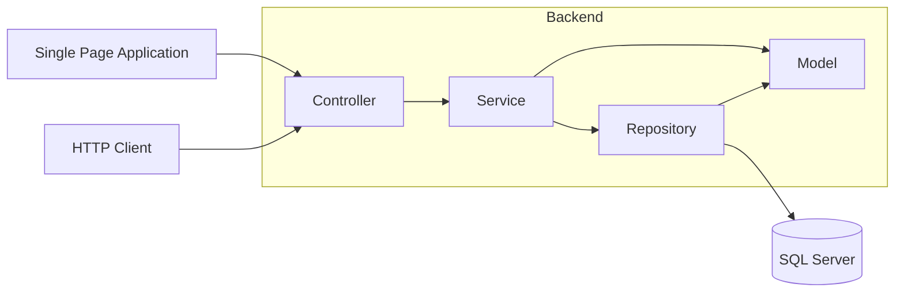

# Bootcamp: Arquiteto(a) de Software — Desafio Final


### Aluno: Vinícius de Jesus Estevam

---

## 1. Introdução

A **PitLaneShop** é uma grande empresa de vendas de produtos automotivos online que necessita da implantação de uma solução para disponibilizar publicamente dados de Cliente, Produto e Pedido aos seus parceiros comerciais.

---

## 2. Documentação de Requisitos

### 2.1 Funcionalidades

| Domínio              | Operação              | Descrição                                     |
|----------------------|-----------------------|-----------------------------------------------|
| Clientes             | CRUD                  | Gestão de Clientes                            |
| Produtos             | CRUD                  | Gestão de Produtos                            |
| Códigos Promocionais | CRUD                  | Gestão de Códigos Promocionais                |
| Pedidos              | Seleção de produtos   | Cliente adiciona produtos ao carrinho         |
| Pedidos              | Aplicação de desconto | Cliente pode inserir um código promocional    |
| Pedidos              | Confirmação do pedido | Cliente confirma os dados e finaliza a compra |
| Pedidos              | Registro do pedido    | Pedido é persistido na base de dados          |

### 2.2 Diagrama de Classes

O diagrama de classes foi desenvolvido com base no modelo clássico de um sistema de vendas, contemplando os seguintes domínios:


Adicionalmente, foi considerado o uso de **códigos promocionais** para aplicação de descontos nos pedidos, bem como a futura integração de **métodos de pagamento**. Este último está definido para implementação futura, em razão do prazo de entrega.

---

## 3. Tecnologias

### 3.1 Backend

Para o desenvolvimento da API RESTful foram selecionadas tecnologias do ecossistema Microsoft:

| Tecnologia            | Descrição                                        |
|-----------------------|--------------------------------------------------|
| C#                    | Linguagem de desenvolvimento da API RESTful      |
| .NET                  | Framework base da aplicação web                  |
| Entity Framework Core | ORM para mapeamento e acesso à base de dados     |
| SQL Server            | Base de dados relacional                         |

### 3.2 Frontend

Para o desenvolvimento da SPA foram selecionadas tecnologias do ecossistema Web:

| Tecnologia | Descrição                                              |
|------------|--------------------------------------------------------|
| TypeScript | Linguagem para desenvolvimento do SPA                  |
| Angular    | Framework estrutural do SPA                            |
| Axios      | Cliente HTTP para comunicação com a API                |
| Tailwind   | Framework utilitário de estilização CSS                |
| PrimeNG    | Biblioteca de componentes visuais para Angular         |

---

## 4. Configuração do Projeto

O backend foi desenvolvido sobre um projeto do tipo ASP.NET Core Web API com suporte à orquestração de contêineres Docker. Ao iniciar, o backend cria automaticamente um banco de dados SQL Server e insere os dados iniciais necessários para a execução do sistema. Para isso, localize o arquivo `docker-compose.yml` e execute o comando:

```bash
docker-compose up
```

O frontend foi inicializado por meio do gerenciador npm, utilizado para criar o projeto Angular 21.

---

## 5. Organização do Projeto

O projeto foi desenvolvido utilizando a arquitetura **MVC** e está estruturado da seguinte maneira:

```
backend/PitLaneShop/PitLaneShop/
├── Controllers/          # Entrada HTTP (REST)
├── Model/
│   ├── Entities/         # Entidades de domínio + EntidadeBase
│   ├── Enums/
│   └── Repositories/     # Apenas interfaces de repositório
├── Persistence/
│   ├── PitLaneShopDbContext.cs
│   ├── EntitiesMapping/  # IEntityTypeConfiguration<T> (Fluent API)
│   ├── Migrations/
│   └── Repositories/     # Implementações EF dos repositórios
├── Services/
│   ├── Abstractions/     # IBaseCrudService + BaseCrudService<TEntity, …>
│   └── Features/
│       └── Cliente/      # DTOs, IClienteService, ClienteService
└── Program.cs            # Composição (DI), pipeline, migrações na inicialização
```

### 5.1 Camada Model

Visando a integridade das entidades, foi criada a camada **Model** com a responsabilidade de centralizar as definições do domínio da aplicação. Esta camada é composta por:

- **Entities** — definição das entidades de domínio
- **Enums** — enumerações utilizadas pelas entidades
- **Repositories** — interfaces que definem os contratos de acesso à base de dados

### 5.2 Camada Persistence

A camada de **Persistência** é responsável pela comunicação com a base de dados e é composta por:

- **Repositories** — implementações dos contratos definidos nas interfaces da camada Model, garantindo que, havendo necessidade de alterar a implementação das operações na base de dados, os contratos sejam respeitados e o sistema não possua funcionalidades estritamente acopladas à implementação
- **EntitiesMapping** — realiza o mapeamento das entidades com as tabelas na base de dados via Fluent API
- **Migrations** — contém os versionamentos das migrações na base de dados conforme a evolução das entidades

### 5.3 Camada Service

A camada de **Serviços** centraliza as regras de negócio da aplicação e é composta por:

- **Abstractions** — contém as abstrações das operações de CRUD, reutilizadas entre entidades com o objetivo de reduzir a redundância de código
- **Features** — contém as implementações dos serviços com operações de CRUD e funcionalidades específicas atreladas às regras de negócio de cada domínio

### 5.4 Camada Controllers

A camada de **Controllers** é responsável por receber as requisições HTTP e direcionar o fluxo dentro do sistema, delegando as operações solicitadas pelos clientes aos serviços correspondentes.

### 5.5 Camada View (SPA)

A camada de **View** foi desenvolvida como uma *Single Page Application* (SPA) e está organizada da seguinte maneira:

```
src/
└── app/
    ├── core/                # Lógica principal da aplicação e configurações
    │   ├── api.service.ts   # Configuração da instância do Axios
    │   ├── environment.ts   # Variáveis de ambiente
    │   ├── models/          # Interfaces TypeScript globais e tipagens
    │   └── services/        # Serviços globais da aplicação
    ├── pages/               # Componentes inteligentes (smart components) servindo como páginas roteáveis
    │   ├── home/            # Página inicial
    │   ├── login/           # Página de autenticação
    │   └── pedido-detalhe/  # Página de detalhes do pedido
    ├── app.config.ts        # Configuração global da aplicação Angular (providers)
    ├── app.config.server.ts # Configuração global para o servidor (SSR)
    ├── app.routes.ts        # Definições das rotas da aplicação
    └── app.component.ts     # Componente raiz
```

- **Core** — armazena variáveis de ambiente, instâncias do Axios (biblioteca para requisições HTTP), models com a representação do input/retorno da API e services para interação com a API e com os componentes da página
- **Pages** — agrupa os componentes necessários para estruturar a página: HTML, CSS e TypeScript
- **Providers** — contém os arquivos de configuração geral para renderização da página, roteamento e estruturação do componente raiz

---

## 6. Fluxo de Comunicação HTTP



1. **Client** — representa os consumidores da API: um usuário interagindo pelo SPA ou um sistema externo (parceiro) comunicando-se diretamente com a API.
2. **Controllers** — recebem a requisição REST, validam o modelo (`[ApiController]`), chamam o serviço correspondente e retornam os códigos HTTP adequados (200, 201, 204, 404, etc.).
3. **Services** — orquestram o caso de uso, trabalham com **DTOs** e realizam o mapeamento para/da entidade.
4. **Repositories** — encapsulam o acesso a dados via **EF Core** (`DbSet<T>`, `UnitOfWork`).
5. **Model** — representa o domínio e é compartilhado entre as camadas de **Services** e **Repositories**.

---

## 7. Diagramas de Arquitetura (C4)

### 7.1 Diagrama de Contexto (Nível 1)

Visando o entendimento dos usuários finais (clientes e parceiros) que interagem com o sistema de vendas — seja realizando uma compra ou acessando informações — foi desenvolvido um Diagrama de Contexto correspondente ao Nível 1 do modelo C4.


### 7.2 Diagrama de Containers (Nível 2)

O **Diagrama de Containers**, correspondente ao Nível 2 do modelo C4, foi elaborado com o objetivo de proporcionar uma visão técnica clara do sistema, permitindo:

- Compreender o fluxo de requisições do cliente dentro do sistema
- Identificar as tecnologias utilizadas em cada contêiner e suas responsabilidades
- Visualizar as relações e comunicações estabelecidas entre os contêineres


### 7.3 Diagrama de Código (Nível 4)

Com o objetivo de demonstrar o fluxo completo de uma requisição, foi desenvolvido o Diagrama de Código do Nível 4 do C4. Como objeto de análise, foi selecionado o domínio do **Pedido**.

O fluxo se inicia com o cliente realizando uma requisição por meio de um SPA ou de um sistema de terceiro que consome a API. O Controller recebe a requisição e a redireciona ao serviço correspondente, passando os parâmetros recebidos. Cabe ao serviço carregar suas dependências — como os repositórios de acesso ao banco de dados dos domínios envolvidos. Por fim, a implementação dos repositórios realiza a persistência da operação executada no banco de dados.

Neste projeto, foi utilizado o padrão **Unit of Work**, que gerencia as transações no banco de dados de forma atômica, assegurando a consistência dos dados por meio da confirmação (commit) da operação ou da reversão para o estado anterior (rollback) em caso de falha.


---

## 8. Estrutura de Implementação

Com base nas implementações apresentadas no Diagrama de Código, seguem as referências para os principais componentes.

### 8.1 Abstrações de CRUD

As operações de CRUD possuem implementações abstratas centralizadas no **BaseService**, que herda da interface **IBaseService**. Esta interface estabelece os contratos de implementação dos métodos. Para cada entidade do domínio, há uma interface que herda de **IBaseService** e cuja implementação concreta herda tanto da respectiva interface quanto da implementação base do **BaseService**.

Essa abordagem permite implementar funcionalidades CRUD para novas entidades de domínio de forma ágil e segura. Como os testes são aplicados à abstração, garante-se padronização do código, redução de duplicação e permite à equipe focar no desenvolvimento de novas funcionalidades.

Entretanto, essa abordagem apresenta desvantagens. Uma delas é a dificuldade de depuração em caso de erros isolados em entidades específicas do domínio, pois, como a implementação é centralizada no **BaseService**, podem surgir problemas decorrentes das abstrações.

Para as classes de serviço, a mesma abordagem foi aplicada, mantendo as implementações base menores e centralizadas, expondo apenas as implementações concretas das funcionalidades mais elaboradas e específicas de cada domínio.

### 8.2 Referências de Implementação

- `Controller`
- `BaseService`
- `IBaseService`
- `BaseRepository`
- `IBaseRepository`
- `BaseEntity`
- `Produto`