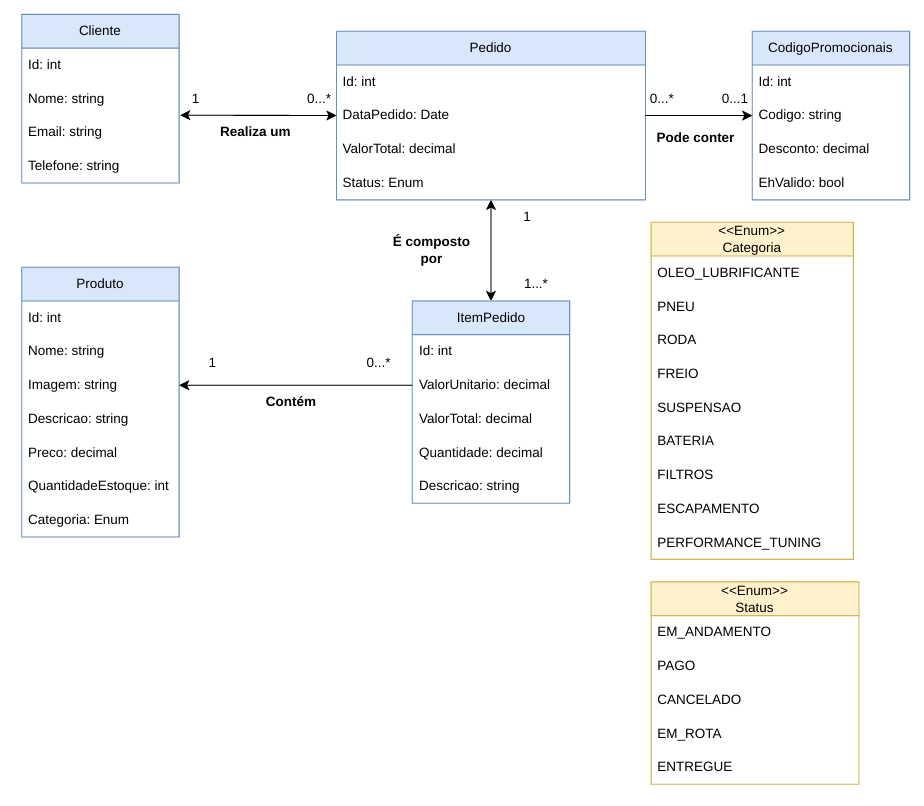
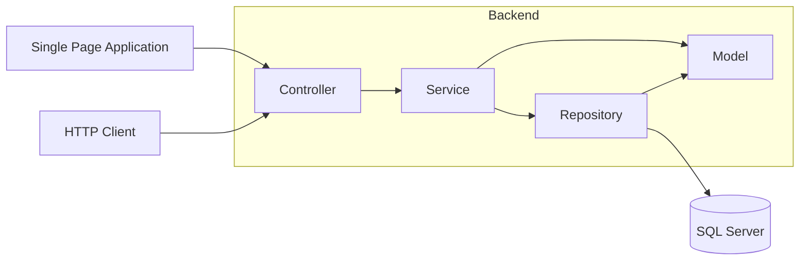
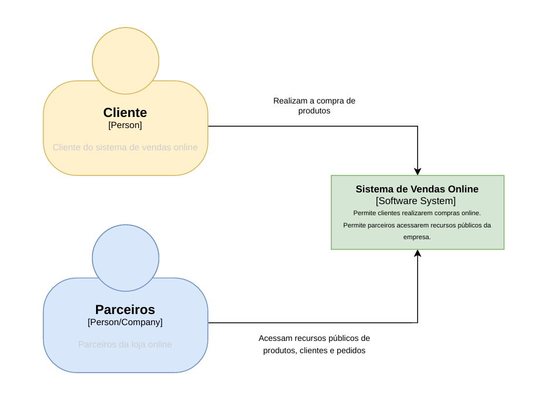
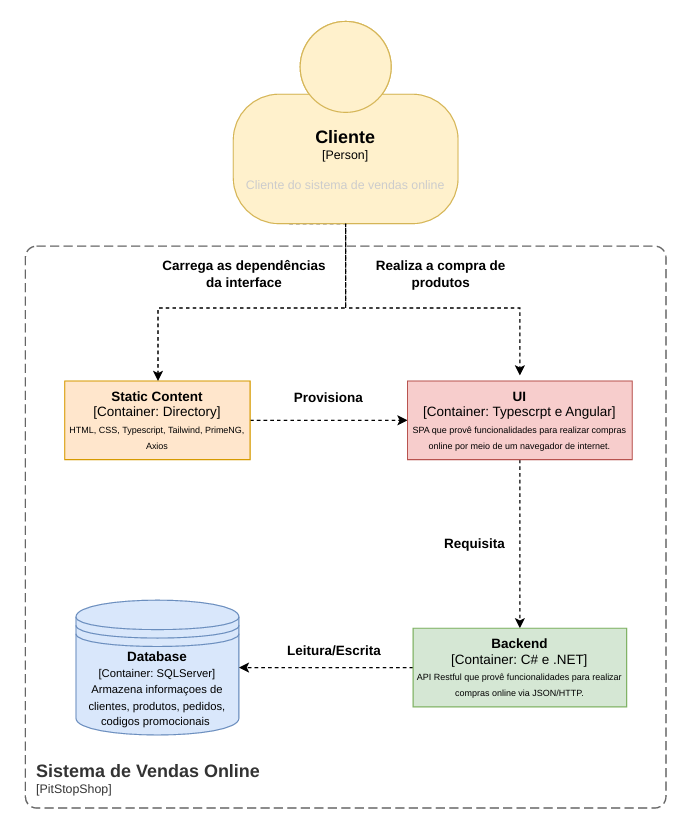
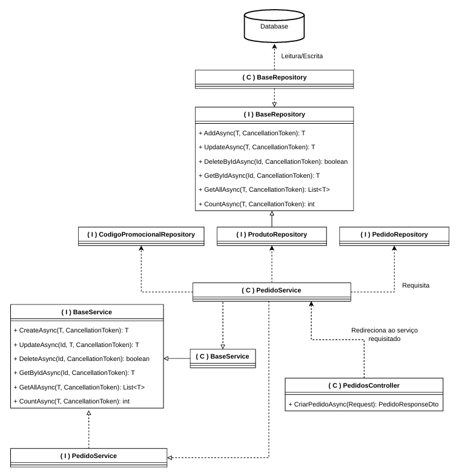

# Bootcamp: Arquiteto(a) de Software — Desafio Final


### Aluno: Vinícius de Jesus Estevam

---

## 1. Introdução

A **PitLaneShop** é uma grande empresa de vendas de produtos automotivos online que necessita da implantação de uma solução para disponibilizar publicamente dados de Cliente, Produto e Pedido aos seus parceiros comerciais.

---

## 2. Documentação de Requisitos

### 2.1 Funcionalidades

| Domínio              | Operação              | Descrição                                     |
|----------------------|-----------------------|-----------------------------------------------|
| Clientes             | CRUD                  | Gestão de Clientes                            |
| Produtos             | CRUD                  | Gestão de Produtos                            |
| Códigos Promocionais | CRUD                  | Gestão de Códigos Promocionais                |
| Pedidos              | Seleção de produtos   | Cliente adiciona produtos ao carrinho         |
| Pedidos              | Aplicação de desconto | Cliente pode inserir um código promocional    |
| Pedidos              | Confirmação do pedido | Cliente confirma os dados e finaliza a compra |
| Pedidos              | Registro do pedido    | Pedido é persistido na base de dados          |

### 2.2 Diagrama de Classes

O diagrama de classes foi desenvolvido com base no modelo clássico de um sistema de vendas, contemplando os seguintes domínios:



Adicionalmente, foi considerado o uso de **códigos promocionais** para aplicação de descontos nos pedidos, bem como a futura integração de **métodos de pagamento**. Este último está definido para implementação futura, em razão do prazo de entrega.

---

## 3. Tecnologias

### 3.1 Backend

Para o desenvolvimento da API RESTful foram selecionadas tecnologias do ecossistema Microsoft:

| Tecnologia            | Descrição                                        |
|-----------------------|--------------------------------------------------|
| C#                    | Linguagem de desenvolvimento da API RESTful      |
| .NET                  | Framework base da aplicação web                  |
| Entity Framework Core | ORM para mapeamento e acesso à base de dados     |
| SQL Server            | Base de dados relacional                         |

### 3.2 Frontend

Para o desenvolvimento da SPA foram selecionadas tecnologias do ecossistema Web:

| Tecnologia | Descrição                                              |
|------------|--------------------------------------------------------|
| TypeScript | Linguagem para desenvolvimento do SPA                  |
| Angular    | Framework estrutural do SPA                            |
| Axios      | Cliente HTTP para comunicação com a API                |
| Tailwind   | Framework utilitário de estilização CSS                |
| PrimeNG    | Biblioteca de componentes visuais para Angular         |

---

## 4. Configuração do Projeto e Execução

A aplicação completa (frontend, backend e banco de dados) foi conteinerizada e está configurada para ser orquestrada de forma simplificada utilizando o Docker. 

Ao rodar o serviço unificado, o backend cria automaticamente o banco de dados SQL Server e insere os dados iniciais necessários para o funcionamento correto do sistema sem necessidade de execuções de scripts adicionais. 

Para inicializar a aplicação, acesse a pasta raiz do projeto, onde encontra-se o arquivo `docker-compose.yml`, e execute o comando abaixo:

```bash
docker-compose up
```

Após o download das imagens (via GitHub Container Registry) e o início de todos os contêineres, os serviços estarão disponíveis nos respectivos endereços locais:

- **Frontend (Angular SPA):** rodando em http://localhost:4000
- **Backend (API REST .NET):** rodando em http://localhost:3000

*O frontend foi inicializado por meio do gerenciador npm usando Angular 21, enquanto o backend é um projeto ASP.NET Core Web API.*

---

## 5. Organização do Projeto

O projeto foi desenvolvido utilizando a arquitetura **MVC** e está estruturado da seguinte maneira:

```
backend/PitLaneShop/PitLaneShop/
├── Controllers/          # Entrada HTTP (REST)
├── Model/
│   ├── Entities/         # Entidades de domínio + EntidadeBase
│   ├── Enums/
│   └── Repositories/     # Apenas interfaces de repositório
├── Persistence/
│   ├── PitLaneShopDbContext.cs
│   ├── EntitiesMapping/  # IEntityTypeConfiguration<T> (Fluent API)
│   ├── Migrations/
│   └── Repositories/     # Implementações EF dos repositórios
├── Services/
│   ├── Abstractions/     # IBaseCrudService + BaseCrudService<TEntity, …>
│   └── Features/
│       └── Cliente/      # DTOs, IClienteService, ClienteService
└── Program.cs            # Composição (DI), pipeline, migrações na inicialização
```

### 5.1 Camada Model

Visando a integridade das entidades, foi criada a camada **Model** com a responsabilidade de centralizar as definições do domínio da aplicação. Esta camada é composta por:

- **Entities** — definição das entidades de domínio
- **Enums** — enumerações utilizadas pelas entidades
- **Repositories** — interfaces que definem os contratos de acesso à base de dados

### 5.2 Camada Persistence

A camada de **Persistência** é responsável pela comunicação com a base de dados e é composta por:

- **Repositories** — implementações dos contratos definidos nas interfaces da camada Model, garantindo que, havendo necessidade de alterar a implementação das operações na base de dados, os contratos sejam respeitados e o sistema não possua funcionalidades estritamente acopladas à implementação
- **EntitiesMapping** — realiza o mapeamento das entidades com as tabelas na base de dados via Fluent API
- **Migrations** — contém os versionamentos das migrações na base de dados conforme a evolução das entidades

### 5.3 Camada Service

A camada de **Serviços** centraliza as regras de negócio da aplicação e é composta por:

- **Abstractions** — contém as abstrações das operações de CRUD, reutilizadas entre entidades com o objetivo de reduzir a redundância de código
- **Features** — contém as implementações dos serviços com operações de CRUD e funcionalidades específicas atreladas às regras de negócio de cada domínio

### 5.4 Camada Controllers

A camada de **Controllers** é responsável por receber as requisições HTTP e direcionar o fluxo dentro do sistema, delegando as operações solicitadas pelos clientes aos serviços correspondentes.

### 5.5 Camada View (SPA)

A camada de **View** foi desenvolvida como uma *Single Page Application* (SPA) e está organizada da seguinte maneira:

```
src/
└── app/
    ├── core/                # Lógica principal da aplicação e configurações
    │   ├── api.service.ts   # Configuração da instância do Axios
    │   ├── environment.ts   # Variáveis de ambiente
    │   ├── models/          # Interfaces TypeScript globais e tipagens
    │   └── services/        # Serviços globais da aplicação
    ├── pages/               # Componentes inteligentes (smart components) servindo como páginas roteáveis
    │   ├── home/            # Página inicial
    │   ├── login/           # Página de autenticação
    │   └── pedido-detalhe/  # Página de detalhes do pedido
    ├── app.config.ts        # Configuração global da aplicação Angular (providers)
    ├── app.config.server.ts # Configuração global para o servidor (SSR)
    ├── app.routes.ts        # Definições das rotas da aplicação
    └── app.component.ts     # Componente raiz
```

- **Core** — armazena variáveis de ambiente, instâncias do Axios (biblioteca para requisições HTTP), models com a representação do input/retorno da API e services para interação com a API e com os componentes da página
- **Pages** — agrupa os componentes necessários para estruturar a página: HTML, CSS e TypeScript
- **Providers** — contém os arquivos de configuração geral para renderização da página, roteamento e estruturação do componente raiz

---

## 6. Fluxo de Comunicação HTTP



1. **Client** — representa os consumidores da API: um usuário interagindo pelo SPA ou um sistema externo (parceiro) comunicando-se diretamente com a API.
2. **Controllers** — recebem a requisição REST, validam o modelo (`[ApiController]`), chamam o serviço correspondente e retornam os códigos HTTP adequados (200, 201, 204, 404, etc.).
3. **Services** — orquestram o caso de uso, trabalham com **DTOs** e realizam o mapeamento para/da entidade.
4. **Repositories** — encapsulam o acesso a dados via **EF Core** (`DbSet<T>`, `UnitOfWork`).
5. **Model** — representa o domínio e é compartilhado entre as camadas de **Services** e **Repositories**.

---

## 7. Diagramas de Arquitetura (C4)

### 7.1 Diagrama de Contexto (Nível 1)

Visando o entendimento dos usuários finais (clientes e parceiros) que interagem com o sistema de vendas — seja realizando uma compra ou acessando informações — foi desenvolvido um Diagrama de Contexto correspondente ao Nível 1 do modelo C4.



### 7.2 Diagrama de Containers (Nível 2)

O **Diagrama de Containers**, correspondente ao Nível 2 do modelo C4, foi elaborado com o objetivo de proporcionar uma visão técnica clara do sistema, permitindo:

- Compreender o fluxo de requisições do cliente dentro do sistema
- Identificar as tecnologias utilizadas em cada contêiner e suas responsabilidades
- Visualizar as relações e comunicações estabelecidas entre os contêineres



### 7.3 Diagrama de Código (Nível 4)

Com o objetivo de demonstrar o fluxo completo de uma requisição, foi desenvolvido o Diagrama de Código do Nível 4 do C4. Como objeto de análise, foi selecionado o domínio do **Pedido**.

O fluxo se inicia com o cliente realizando uma requisição por meio de um SPA ou de um sistema de terceiro que consome a API. O Controller recebe a requisição e a redireciona ao serviço correspondente, passando os parâmetros recebidos. Cabe ao serviço carregar suas dependências — como os repositórios de acesso ao banco de dados dos domínios envolvidos. Por fim, a implementação dos repositórios realiza a persistência da operação executada no banco de dados.

Neste projeto, foi utilizado o padrão **Unit of Work**, que gerencia as transações no banco de dados de forma atômica, assegurando a consistência dos dados por meio da confirmação (commit) da operação ou da reversão para o estado anterior (rollback) em caso de falha.



---

## 8. Estrutura de Implementação

Com base nas implementações apresentadas no Diagrama de Código, seguem as referências para os principais componentes.

### 8.1 Abstrações de CRUD

As operações de CRUD possuem implementações abstratas centralizadas no **BaseService**, que herda da interface **IBaseService**. Esta interface estabelece os contratos de implementação dos métodos. Para cada entidade do domínio, há uma interface que herda de **IBaseService** e cuja implementação concreta herda tanto da respectiva interface quanto da implementação base do **BaseService**.

Essa abordagem permite implementar funcionalidades CRUD para novas entidades de domínio de forma ágil e segura. Como os testes são aplicados à abstração, garante-se padronização do código, redução de duplicação e permite à equipe focar no desenvolvimento de novas funcionalidades.

Entretanto, essa abordagem apresenta desvantagens. Uma delas é a dificuldade de depuração em caso de erros isolados em entidades específicas do domínio, pois, como a implementação é centralizada no **BaseService**, podem surgir problemas decorrentes das abstrações.

Para as classes de serviço, a mesma abordagem foi aplicada, mantendo as implementações base menores e centralizadas, expondo apenas as implementações concretas das funcionalidades mais elaboradas e específicas de cada domínio.

### 8.2 Referências de Implementação

- [**Controller**](backend/PitLaneShop/PitLaneShop/Controllers): Diretório contendo os controladores da API, responsáveis por expor os endpoints e tratar as requisições HTTP (ex. herdam de `ControllerBase`).
- [**BaseService** (`BaseCrudService`)](backend/PitLaneShop/PitLaneShop/Services/Abstractions/BaseCrudService.cs): Classe abstrata que fornece a implementação genérica das operações de CRUD, evitando a duplicação de lógica entre os serviços.
- [**IBaseService** (`IBaseCrudService`)](backend/PitLaneShop/PitLaneShop/Services/Abstractions/IBaseCrudService.cs): Interface que define os contratos obrigatórios das operações de CRUD para as classes de serviço.
- [**BaseRepository**](backend/PitLaneShop/PitLaneShop/Persistence/Repositories/BaseRepository.cs): Implementação de repositório genérico utilizando o Entity Framework Core com os métodos padrão para acesso aos dados.
- [**IBaseRepository**](backend/PitLaneShop/PitLaneShop/Model/Repositories/IBaseRepository.cs): Interface que determina os contratos dos repositórios para comunicação com o banco de dados.
- [**BaseEntity** (`EntidadeBase`)](backend/PitLaneShop/PitLaneShop/Model/Entities/EntidadeBase.cs): Classe base das entidades de domínio, encarregada de centralizar propriedades compartilhadas (ex. identificador `Id`).
- [**Produto**](backend/PitLaneShop/PitLaneShop/Model/Entities/Produto.cs): Classe referente à entidade de domínio.
- [**ProdutoService**](backend/PitLaneShop/PitLaneShop/Services/Features/Produto/Implementation/ProdutoService.cs): Classe de serviço contendo o fluxo de validações e regras de negócio para a entidade Produto.
- [**ProdutoController** (`ProdutosController`)](backend/PitLaneShop/PitLaneShop/Controllers/ProdutosController.cs): Controlador que expõe os endpoints HTTP específicos da entidade Produto.
- [**ProdutoRepository**](backend/PitLaneShop/PitLaneShop/Persistence/Repositories/ProdutoRepository.cs): Repositório concreto dedicado à persistência e consulta dos dados da entidade Produto no banco.

Outros domínios seguem a mesma estrutura de implementação como por exemplo:
- Cliente
- Pedidos
- CodigoPromocionais

## 9. Considerações Finais

## 9.1 Considerações sobre a arquitetura

A arquitetura MVC foi selecionada conforme o enunciado apresentado, a possibilidade de utilização de outras arquiteturas foi comunicada na ultima aula, porém estava à 3 dias da entrega, optei por manter a escolha original para não comprometer o prazo. Para um cenário de MVP, a arquitetura MVC estruturada em um monolito seria ideal para prototipação e validação de funcionalidades e regras de negócio. 

Visando uma escala nacional ou até mesmo global seria mais adequado a separação dos de serviçoes por dominio ou até mesmo microsserviço com Clean Architecture que permite o
isolamento e centralização da regra de negócio domínio, independência de framework como por exemplo a camada de persistência pode ser um projeto .NET separado dentro da solução, implementado seguindo os contratos definidos pelo Core (Domain) e reutilizado por diferentes APIs, substituição de tecnologia sem impacto no domínio, podemos usar como exemplo a necessidade de trocar Dapper por Entity Framework Core, ou migrar de banco relacional para NoSQL, bastando desacoplar o projeto atual e acoplar um novo que siga os contratos estabelecidos


Isso permite que times grandes trabalhem em camadas isoladas de forma paralela, sem impactar o core do domínio, e favorece a elevação do índice de cobertura de testes — uma vez que a troca de componentes exige testes para assegurar a integridade da substituição.

A dependência entre camadas segue o sentido:


Também podemos considerar a arquitetura Hexagonal que possui os mesmos benefícios da Clean Architecture, com o diferencial de isolar ainda mais o domínio e os casos de uso. Nela o Domain e a Application formam um núcleo unificado, enquanto as camadas de infraestrutura, apresentação e demais integrações tornam-se adaptadores.
Uma API pode ter diferentes adaptadores para interagir com:

- Diferentes clientes (REST, gRPC, CLI)
- Diferentes bancos de dados
- Diferentes sistemas externos

Para o sistema de vendas, essa arquitetura se mostrou a mais adequada, considerando a possibilidade de integração com diferentes meios de pagamento e futuras implementações, bastando definir um novo adaptador.

Cada domínio pode ser estruturado como um serviço independente, onde cada serviço acessa apenas o que é pertinente ao seu próprio escopo. Quando necessário interagir com outros domínios, os domínios são:

- Clientes
- Pedidos
- Produtos
- Códigos promocionais
- Pagamentos (implementação futura)

Visando a comunicação entre os dominios pode ser considerado como uma opção mais adequada a necessiade do cliente a utilizando ferramentas como RabbitMQ ou Apache Kafka, onde a solicitação é enviada como mensagem e o processamento ocorre pelo domínio responsável.

A abordagem por filas traz vantagens significativas em termos de experiência do usuário e uso de recursos:

- Resposta imediata ao cliente — ao receber um pedido, a API retorna uma confirmação de que o pedido está sendo processado, sem bloquear o cliente enquanto a operação é concluída
- Tolerância a processamentos complexos — pedidos com lógica elaborada ou alta carga de dados são processados em segundo plano, com notificação posterior via sistema, e-mail ou SMS
- Liberação de recursos — a API que recebe o pedido (API A) envia a mensagem para a API de processamento (API B) e fica imediatamente disponível para atender novos clientes, sem aguardar o retorno da API B


### 9.2. Considerações em relação ao auxilio da IA

O projeto foi desenvolvido usando o Cursor com o agente Claude Opus 4.6. A base de tudo foi criar arquivos em formato markdown para guiar o agente ao longo do desenvolvimento:

- [`diagrama.md`](agent/diagram.md) — representação das entidades e suas relações, usado como referência de domínio
- Arquivos de arquitetura para backend e frontend — estrutura de pastas, tecnologias e fluxos de requisição
- Arquivos de workflow por feature — guiam a implementação camada por camada, com padrão de nomenclatura e regras


A implementação seguiu do Backend o [`agente-crud-task-workflow.md`](agent/backend/.agent/agent-crud-task-workflow.md), começando pelas abstrações base: `BaseEntity`, `BaseRepository` e `BaseService`. Em seguida o fluxo completo de CRUD das features foi implementado. A feature de criar pedido foi a mais complexa até o momento. Ela envolve múltiplos domínios: cliente, produto, validação de código promocional, cálculo de valores e persistência no banco como uma transação atômica. O agente usou o `SaveChanges` do EF Core inicialmente. Foi solicitada a implementação do padrão **Unit of Work** para gerenciar as transações, garantindo que todas as operações dentro do contexto da requisição sejam tratadas como uma só. Além disso, os DTOs tinham métodos internos de conversão. Foi solicitado o uso do **AutoMapper** para simplificar o mapeamento entre DTOs e entidades. Os controllers foram implementados de forma repetitiva, sem aproveitar a mesma lógica de abstração aplicada no `BaseService` e `BaseRepository`. O agente não identificou esse padrão de repetição nem sugeriu a refatoração. Isso evidencia que o desenvolvedor precisa ter conhecimento sólido em padrões de projeto, arquitetura e tecnologia para usar ferramentas de IA com eficácia, definindo regras bem estruturadas nos arquivos de guia.


O agente optou por usar exceções nos services, o que não é ideal. A abordagem preferida é o padrão **Result**, onde um objeto de retorno encapsula:

- status da operação
- dado retornado
- mensagens de sucesso ou erro

Isso melhora o fluxo de informação entre camadas e reduz o uso de exceções, que consomem recursos significativos de memória e devem ser reservadas para casos reais de falha como erro de conexão com banco, falha em integração com serviço externo, ou indisponibilidade de um recurso essencial.

Erros de validação de entrada do usuário e de regras de negócio **não devem ser tratados como exceção**.


Para implementação do Frontend estrutura foi mantida simples:

- `core/` — objetos de envio/retorno da API, services de requisição
- `pages/` — agrupamento de HTML, CSS e lógica de tela

Em alguns arquivos `.ts` dentro de `pages/`, o agente misturou chamadas de service, funções de formatação, lógica de tela e controle de estado no mesmo lugar. Como melhoria, esses arquivos seriam decompostos em objetos compostos, onde cada objeto de composição teria uma responsabilidade específica lógica de componente, lógica de tela, formatação e poderia ser reutilizado por outros objetos.

Faria a separação entre:

- Services de **interação com a API**
- Services de **lógica de negócio**

Por exemplo, o [`cart.service.ts`](frontend/PitLaneShop/src/app/core/services/cart.service.ts) contém lógica de estado do carrinho, mas foi colocado em `core/services`. O correto seria movê-lo para `pages/` como um objeto de composição do `home.component.ts`, já que o carrinho pertence à page home. Ainda sobre essa página o `html` poderia ter sido componentizado, especialmente a parte do carrinho. O agente não buscou aplicar essa boa prática nem sugeriu melhorias no workflow.


Para um projeto de nível educacional, o tempo de implementação foi bem curto especialmente quando a arquitetura, o domínio, a estrutura de arquivos e as boas práticas estão bem definidos.

#### Melhorias identificadas para workflows futuros

Os arquivos de workflow do agente serão evoluídos para incluir:

- Adição de Abstrações para os componentes que faltam como o controller
- Estruturações de projeto do frontend
- Regras de nomenclatura
- Tratativa de erros padronizada (padrão Result)

#### Fluxo ideal de execução

1. Agente lê a feature a ser implementada
2. Busca o arquivo de referência do workflow da task
3. Entende o domínio e a arquitetura
4. Segue a implementação
5. Finaliza com testes gerados e funcionais

#### Possível evolução com múltiplos agentes

Dependendo da maturidade da feature, poderiam existir agentes especializados:

- Um para backend
- Um para frontend
- Um para testes
- Um para identificar melhorias ao longo do desenvolvimento

Ficaria a cargo do desenvolvedor revisar o que foi gerado, analisar as sugestões de melhoria e decidir o que entra no primeiro ciclo de entrega ou vai para o backlog de débito técnico.

#### Rastreabilidade das atividades

Recomendo manter um **arquivo de histórico das atividades do agente**. Ao final de cada feature, o agente registra a tarefa e referencia os arquivos criados ou modificados. Isso facilita rastreabilidade em casos de bug, erro, melhoria ou responsabilização.